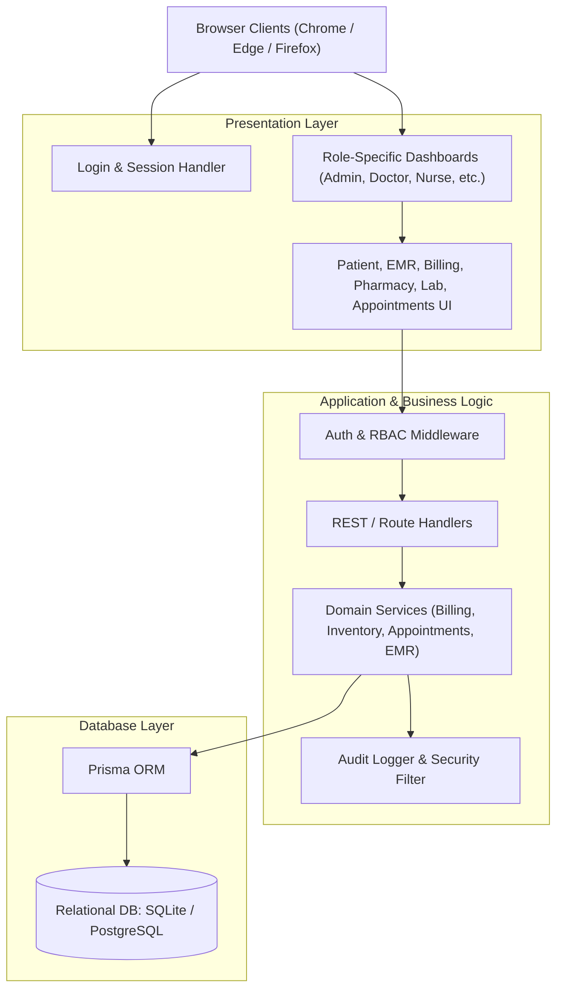
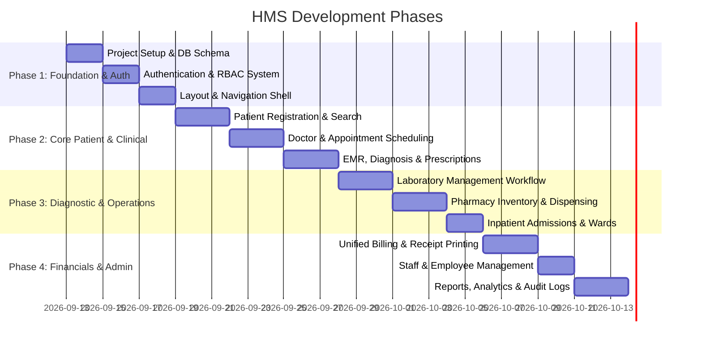

# Hospital Management System (HMS) - Tech Stack & Implementation Plan

## Executive Summary
This document provides the architectural evaluation, recommended technology stack, module breakdown, database schema design, and step-by-step development roadmap for the **Hospital Management System (HMS)** defined in the Software Specification Document.

The HMS requires a robust 4-tier architecture supporting **7 distinct user roles** (Administrator, Doctor, Nurse, Receptionist, Laboratory Staff, Pharmacist, Accountant) across **10 core operational modules** (Patient Management, EMR, Appointments, Pharmacy, Lab, Billing, Inpatient Admissions, Staff Management, Reporting, and User/Role Security).

---

## 1. Tech Stack Evaluation & Recommendation

Based on the system requirements (4-layer architecture, role-based access control, responsive dashboards, reporting, invoice printing) and your local development environment (**Node.js v26**, **npm v11**, **Python 3.14**, **.NET 10** available; no external DB daemon like MySQL or Docker pre-installed):

### Recommended Stack: **Modern TypeScript Full-Stack (Next.js / React + Node.js + Prisma ORM)**

| Layer | Recommended Technology | Why It Fits This Project |
| :--- | :--- | :--- |
| **Presentation Layer** | **React / Next.js (TypeScript)** with modern CSS & Tailwind/CSS Modules | Dynamic role-based dashboards, responsive calendar views for appointments, fast tab navigation, ready for print-optimized medical prescriptions and invoices. |
| **Application / API Layer** | **Node.js + Next.js App Router (or Express/NestJS API)** | High performance, lightweight, unified TypeScript data contracts from frontend to backend. Handles file uploads (lab attachments, patient IDs) smoothly. |
| **Business Logic Layer** | **TypeScript Services & Domain Handlers** | Strict validation of medical logic (e.g. drug dispensing vs. stock levels, billing aggregation, appointment overlap prevention). |
| **Database & ORM Layer** | **Prisma ORM with SQLite (Development) / PostgreSQL or MySQL (Production)** | **Crucial Advantage:** Runs instantly with zero external database configuration on your Windows machine. When ready for production deployment, changing `provider = "sqlite"` to `"postgresql"` or `"mysql"` takes under 5 minutes without rewriting queries. |
| **Authentication & RBAC** | **JWT / NextAuth (Session-based with RBAC)** | Secure password hashing (bcrypt), token rotation, automatic session expiration, and role-guarded route middleware. |
| **Charts & Reporting** | **Recharts / Chart.js + HTML5 Print CSS / PDF export** | Visual analytics for revenue, patient visits, medicine expiry alerts, and lab workload summaries. |

---

### Alternative Tech Stack Options

1. **Option B (Python Enterprise): FastAPI + React + SQLAlchemy + SQLite/Postgres**
   - *Strengths:* Excellent for data manipulation, analytics, and potential future AI-based clinical decision support.
   - *Trade-off:* Separate frontend and backend processes to manage in development.
2. **Option C (.NET Core Enterprise): ASP.NET Core 10 Web API + React / Blazor + EF Core**
   - *Strengths:* Native fit for enterprise Windows Server environments and SQL Server.
   - *Trade-off:* Heavier boilerplate for rapid iterative development.

---

## 2. System Architecture & Role-Based Access Control (RBAC)

### Role Matrix & Permissions

| Role | Accessible Modules & Core Actions |
| :--- | :--- |
| **Administrator** | Full system control: User management, employee records, department configs, audit logs, database backup, high-level financial & operational reports. |
| **Doctor** | Assigned department schedule, patient consultation queue, clinical diagnosis, electronic prescriptions, lab order placement, treatment history. |
| **Nurse** | Inpatient ward bed management, patient vital signs recording, treatment assistance, admission tracking. |
| **Receptionist** | Patient registration & profile edits, doctor lookup, appointment booking, rescheduling & status updates, patient check-in. |
| **Laboratory Staff** | Lab test requests queue, sample collection logging, test result entry, report generation & document uploads. |
| **Pharmacist** | Medicine inventory catalog, batch & expiry monitoring, stock adjustments, prescription fulfillment & dispensing. |
| **Accountant** | Aggregated invoice generation (Doctor consultation + Lab tests + Pharmacy drugs + Inpatient bed charges), payment recording, receipt printing. |

---

## 3. Database Schema Blueprint (Prisma Models)

The database will be structured across 13 interconnected entities:

1. **`User` & `Role`**: Multi-role authentication, hashed passwords, active status, last login timestamp.
2. **`Employee`**: Staff details, department, designation, attendance records, leave history.
3. **`Department`**: Cardiology, Pediatrics, OPD, Radiology, Emergency, Pharmacy, etc.
4. **`Doctor`**: Link to `User` & `Employee`, specialization, consultation fee, available time slots.
5. **`Patient`**: Patient ID (MRN), personal info, blood group, emergency contact, document attachments.
6. **`Appointment`**: Patient, Doctor, slot time, token number, status (`SCHEDULED`, `COMPLETED`, `CANCELLED`, `NO_SHOW`).
7. **`Admission` (Inpatient)**: Ward/Room/Bed number, admission date, discharge date, attending doctor/nurse, status.
8. **`MedicalRecord` (EMR)**: Visit notes, diagnosis codes, symptoms, vitals (BP, pulse, temp, weight).
9. **`Prescription` & `PrescriptionItem`**: Link to medical record, medicine ID, dosage, frequency, duration, dispensed status.
10. **`Medicine` & `Inventory`**: Generic name, brand, batch number, stock quantity, unit cost, selling price, expiry date.
11. **`LabTest` & `LabOrder`**: Test catalog (e.g. CBC, Lipid Profile), order status (`PENDING`, `SAMPLE_COLLECTED`, `COMPLETED`), results, reference ranges.
12. **`Invoice` & `InvoiceItem`**: Unified bill aggregating consultations, medicines, lab tests, and room stay; subtotal, tax, discount, grand total.
13. **`Payment` & `AuditLog`**: Payment method (Cash/Card/Insurance), amount paid, receipt number, audit trail for changes.

---

## 4. Phased Implementation Roadmap

### Phase Details

#### **Phase 1: Foundation, Design System & Authentication**
- Scaffold the project (Next.js 15+ / React with TypeScript).
- Configure Prisma ORM with SQLite for zero-friction local development.
- Implement User Authentication with secure JWT / session cookies and password encryption (`bcrypt`).
- Build responsive sidebar layout with role-conditional navigation items and theme.
- Create seed data with 1 default user for each of the 7 roles + sample departments.

#### **Phase 2: Patient Registration, Appointments & EMR**
- **Patient Management:** Quick registration form, medical history lookup, emergency contacts, search by name/phone/ID.
- **Doctor & Scheduling:** Doctor profiles, availability slots, calendar/weekly agenda views.
- **Appointments:** Booking interface for receptionists and doctors, status tracking (Upcoming, Checked In, In-Consultation, Completed, Cancelled).
- **EMR Module:** Doctor consultation desk: vital signs entry, diagnosis, prescription builder with automatic drug search.

#### **Phase 3: Laboratory, Pharmacy & Inpatient Management**
- **Laboratory Module:** Doctors order lab tests -> Lab tech sees worklist -> Updates sample status -> Enters numeric/text results -> Generates printable lab test report.
- **Pharmacy Module:** Drug inventory management with real-time stock levels, low-stock notifications, expiry date alerts, and one-click prescription dispensing.
- **Inpatient Admissions:** Room/bed allocation, daily vitals, admission status, discharge clearance.

#### **Phase 4: Billing, Staff Management & Analytics**
- **Unified Billing System:** Aggregates doctor fees, prescribed medicines, lab tests, and room stay charges into a consolidated invoice. Supports payments and printable thermal/A4 receipts.
- **Staff & Leave Management:** Employee profiles, attendance logging, leave request workflow.
- **Reports & Analytics:** Dashboard metric cards (Total Patients, Today's Appointments, Revenue Breakdown, Pending Lab Tests, Low Stock Alerts) and charts.
- **Security & Backup:** Audit log viewer for administrative oversight, one-click SQLite database export/backup.

---

## 5. Verification & Testing Plan

### Automated Verification
- **Prisma Schema Validation:** `npx prisma validate` & `npx prisma db push` to ensure data integrity.
- **API Endpoint Tests:** Test authentication endpoints, role permission enforcement, appointment overlap validation, and inventory deduction logic.
- **TypeScript Type Checks:** Run `tsc --noEmit` to guarantee complete type safety across all frontend and backend components.

### Manual Verification Flows
1. **Multi-Role Simulation:**
   - Log in as **Receptionist** -> Register Patient -> Book Appointment with Dr. Smith.
   - Log in as **Doctor** -> View appointment in calendar -> Enter diagnosis & prescribe Amoxicillin + order Blood Test.
   - Log in as **Lab Staff** -> Collect sample -> Enter results -> Mark completed.
   - Log in as **Pharmacist** -> Dispense prescribed medication -> Confirm inventory stock count decrements.
   - Log in as **Accountant** -> Generate unified invoice -> Verify all items match -> Record cash payment -> Preview receipt.
   - Log in as **Admin** -> Verify audit trail logs and review revenue dashboard metrics.
2. **UI & Responsiveness:**
   - Verify on standard desktop (1920x1080) and tablet viewport.
   - Test print layouts for invoices, prescriptions, and lab reports using browser print preview.
